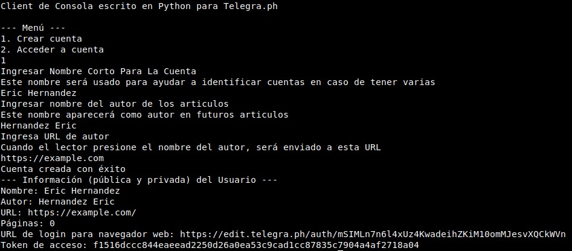
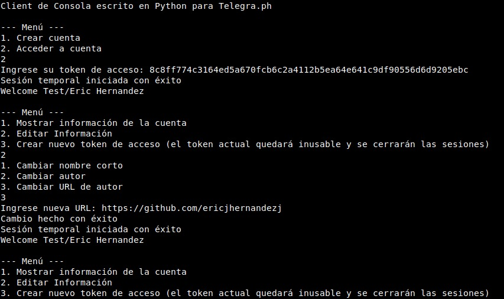

# Python Telegraph CLI Client

Cliente de consola escrito en Python para Telegraph [Telegraph](https://telegra.ph), herramienta de Blogging minimalista desarrollada por Telegram.

**v1.0.4**

## Instalar dependencias

### Windows

```bash
pip -m install request
```

### Linux

```bash
pip3 install request
```

## Clonar el repositorio y entrar a la carpeta

```bash
git clone https://github.com/ericjhernandezj/py-telegraph-cli-client.git
cd py-telegraph-cli-client/
```

## Correr el cliente de Telegraph

```bash
python3 main.py
```

## Funcionalidades

- Permite crear una cuenta en Telegraph desde la consola, devolviendo un token de acceso y un enlace para iniciar sesión en un navegador web.
- Permite iniciar sesión en una cuenta existente para ver y modificar información de la cuenta, incluso generar nuevo token de acceso y cerrar sesiones.

## Cómo Contribuir

- Haz fork de este repositorio.
- Haz los cambios que consideres útiles o necesarios.
- Crea un Pull Request

Recuerda crear un commit por cada cambio independiente en tu PR. De esa forma será más fácil de analizar y realizar el merge.

También puedes crear un Issue con sugerencias o ideas.

## Capturas de Pantalla

Creando una cuenta


Iniciando sesión


## To-Do

[View To-Do list](to-do.md)

## Licencia

[MIT](https://choosealicense.com/licenses/mit/)
